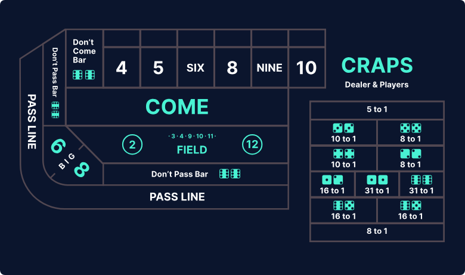

    
<a href="#"></a>

    <h1>How to play Craps</h1>

### What the heck is Craps?
Craps is arguably one of the most lively and social games in the Casino. The game revolves around betting on the outcome of a roll, or the series of rolls, of two six-sided dice.

You can try Craps on [The Wizard of Odds](https://wizardofodds.com/play/craps/v2/) for free to see how the game works while referring to the information below.

### Craps Simulation Goals
The game Craps is super interesting as it really is just a game about rolling dice on numbers you bet it will land on. I am fairly new into this and I wanted to do some work on it.

This simulation is to help with strategies for the Dice Game Craps. This will try and display as many strategies for this game using numbers and graphs (hopefully).

### Basic Rules and Terminology
Whether or not you play Craps online or in a Casino, the rules are usually similar.

Here is a basic idea of a round:
1. Make Bets on the outcome of the dice
2. Roll the Dice to Establish a Point
3. Add more, less, or no more bets
4. Keep rolling the dice
5. Hit the Point before rolling a seven (or maybe you want the seven based on how you bet!)

### Number Odds
Here is a table that describes dice combinations and chances:
| Roll Result | Ways to Roll                     | Probability (%) |
|-------------|----------------------------------|-----------------|
| 2           | 1 (1+1)                          | 2.78% (1/36)    |
| 3           | 2 (1+2, 2+1)                     | 5.56% (2/36)    |
| 4           | 3 (1+3, 2+2, 3+1)                | 8.33% (3/36)    |
| 5           | 4 (1+4 2+3, 3+2, 4+1)            | 11.11% (4/36)   |
| 6           | 5 (1+5, 2+4, 3+3, 4+2, 5+1)      | 13.89% (5/36)   |
| 7           | 6 (1+6, 2+5, 3+4, 4+3, 5+2, 6+1) | 16.67% (6/36)   |
| 8           | 5 (2+6, 3+5, 4+4, 5+3, 6+2)      | 13.89% (5/36)   |
| 9           | 4 (3+6, 4+5, 5+4, 6+3)           | 11.11% (4/36)   |
| 10          | 3 (4+6, 5+5, 6+4)                | 8.33% (3/36)    |
| 11          | 2 (5+6, 6+5)                     | 5.56% (2/36)    |
| 12          | 1 (6+6)                          | 2.78% (1/36)    |

### The Craps Board & Bets
You will see a variation of the image below in the Casino (or online):

    

Let's Talk about some typical bets:
1. The Pass Line & Don't Pass Bar
    * Pass Line
        * The Odds Bet
    * Don't Pass Bar
2. Big 6 & Big 8
3. The Field
4. The Come & Don't Come Bar
5. Place Bets
6. Buy Bets
7. Lay Bets
8. Center Bets

### Basic Strategies

### Advanced Strategies

### References
* [How to Play Craps for Beginners](https://www.onlinegambling.com/casino/craps/how-to-play/)
