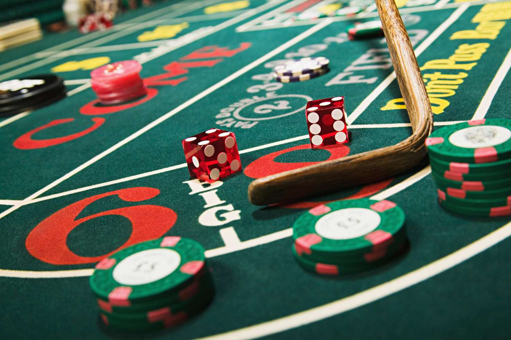

    
<a href="#"></a>

    <h1>How to play Craps</h1>

## Craps Simulation Goals
The game Craps is super interesting as it really is just a game about rolling dice on numbers you bet it will land on. I am fairly new into this and I wanted to do some work on it.

This simulation is to help with strategies for the Dice Game Craps. This will try and display as many strategies for this game using numbers and graphs (hopefully).

## Basic Rules and Terminology

## Basic Strategies

## Advanced Strategies

## References
